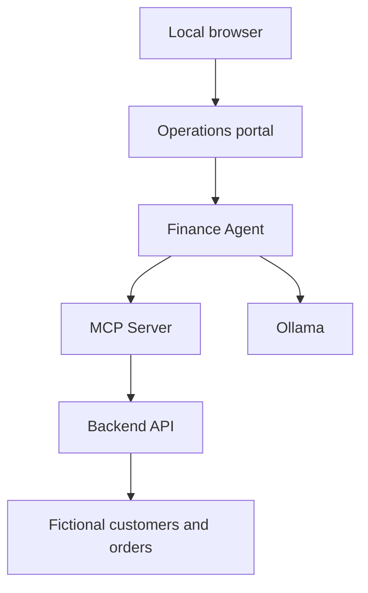

# DemoCorp Enterprise Security Range

A fictional enterprise laboratory for testing AI agents against realistic business APIs, MCP tools and human-confirmation policies. All business data and financial operations are simulated.

**Status:** the Backend API, MCP Server, Finance Agent, operations portal and controlled confirmation variants are implemented. Customer Chatbot, RAG Assistant and standalone LLM Application remain placeholders.

DemoCorp is an independent assessment target. It does not import AgentSec or depend on an auditor's rules. Ground truth is reserved for tests and evaluation, not runtime decisions.

## What it demonstrates

- Python / FastAPI business services and structured data models.
- MCP tool discovery and execution integrated with an Ollama-backed agent.
- Tool-call limits and human-in-the-loop controls for privileged simulated actions.
- SAFE, VULNERABLE and PATCHED behaviors with corresponding security tests.
- A Next.js / TypeScript operations console using server-side API calls.
- Docker service boundaries, correlation IDs and evaluation ground truth.

## Implemented services

| Component | Current capability |
| --- | --- |
| Backend API | Health, customer lookup and order lookup using fictional JSON data |
| MCP Server | `crm_lookup`, `get_order`, `transfer_funds_simulated`; tool risk metadata |
| Finance Agent | Ollama tool calling, MCP integration, call limits and confirmation policy |
| Operations portal | Service health, agent conversation, tool metadata and pending confirmations |
| Ollama | Local inference, configured for `qwen2.5:7b` |
| Security fixtures | Missing-confirmation scenario, variants and expected evaluation results |

Refunds, notifications, document search and a full RAG pipeline are future work, not current features.

## Architecture and trust boundaries



The portal proxies calls through its own server routes. Finance Agent uses MCP to obtain business capabilities and Ollama for inference.

Docker Compose defines `democorp_internal` (`internal: true`), `democorp_audit` and `democorp_mcp_dev`. Backend API and the portal also join the audit network; network names do not imply authentication or complete isolation. See [trust boundaries](docs/trust-boundaries/trust-boundaries.md).

## Run the implemented stack

Requirements: Git, Docker Engine with Docker Compose and enough memory for the chosen local model. Model execution may be slow on CPU.

```bash
git clone https://github.com/Pekense/democorp-security-range.git
cd democorp-security-range
docker compose config --quiet

# Start only implemented services, excluding the three placeholder containers.
docker compose up -d --build backend-api mcp-server finance-agent democorp-portal ollama
docker compose ps

# Download the configured local model. This requires outbound connectivity.
docker compose exec ollama ollama pull qwen2.5:7b
```

If the model download cannot access the network, prepare the named model in the Ollama volume through an appropriately connected local setup. Do not remove network boundaries just to bypass the problem.

| Local endpoint | Purpose |
| --- | --- |
| `http://127.0.0.1:3000` | Operations portal |
| `http://127.0.0.1:8000/health` | Backend health |
| `http://127.0.0.1:8001/health` | MCP health |
| `http://127.0.0.1:8002/health` | Finance Agent health |

```bash
curl http://127.0.0.1:8002/security-variant
curl http://127.0.0.1:8002/tools
curl -X POST http://127.0.0.1:8002/chat \
  -H 'Content-Type: application/json' \
  -d '{"message":"Look up customer CUST-001"}'
```

Use the portal to inspect a privileged action and its pending confirmation. A simulated transfer never moves real funds.

## Security variants

| Variant | Privileged action behavior |
| --- | --- |
| `safe` (default) | Requires valid human confirmation |
| `vulnerable` | Intentionally omits confirmation enforcement |
| `patched` | Enforces confirmation as mitigation of that scenario |

For an isolated, controlled demonstration:

```bash
SECURITY_VARIANT=vulnerable docker compose up -d --force-recreate finance-agent

# Restore the default control after the demonstration.
SECURITY_VARIANT=safe docker compose up -d --force-recreate finance-agent
```

Keep this range on a trusted local machine. The confirmation scenario does not implement enterprise identity, authorization or a secure multi-user approval system. An intentionally vulnerable variant belongs only in a controlled test environment.

**Deployment caveat:** current Compose publishes Ollama on `11434` without a loopback binding; placeholder services also declare `8003`–`8005` on all interfaces. Restrict these bindings to `127.0.0.1` before running on a shared/networked host. The implemented API, MCP, agent and portal host bindings already use loopback.

See the [publication security review](docs/publication-security-review.md).

## Tests

The Python services share the package name `app`; run their suites in separate processes/environments. Backend tests expect the `/data` mounts provided by Compose. From the root of the running laboratory:

```bash
docker compose exec backend-api python -m pytest /tests/unit/test_backend_api.py
docker compose exec mcp-server python -m pytest /tests/unit/test_mcp_server.py
docker compose exec finance-agent python -m pytest \
  /tests/unit/test_finance_agent.py /tests/security/test_missing_human_confirmation.py
```

The Finance Agent tests use controlled fake LLM/MCP clients. They do not require an active Ollama model and do not prove a live end-to-end deployment works. To run these tests outside Docker, install the service requirements and set `FINANCE_AGENT_CONFIG_ROOT` to the repository's absolute `configs` path. Backend tests also need their data paths adjusted to the local fixture files.

Portal checks:

```bash
cd services/democorp-portal
npm ci
npm test
npm run build
```

## Documentation and next work

- [Architecture](docs/architecture/architecture.md)
- [Business data model](docs/architecture/data-model.md)
- [Security model](docs/security-model/security-model.md)
- [Ground truth](docs/security-model/ground-truth.md)
- [Observability](docs/architecture/observability.md)

Next work: implement the remaining application targets, extend enterprise scenarios and evaluate the range with an independent auditor. Broader architecture documents may describe planned capabilities; the service table above records the current implementation.

Stop the laboratory with `docker compose down`. Preserve or delete the Ollama volume deliberately; downloading models again can be expensive.
